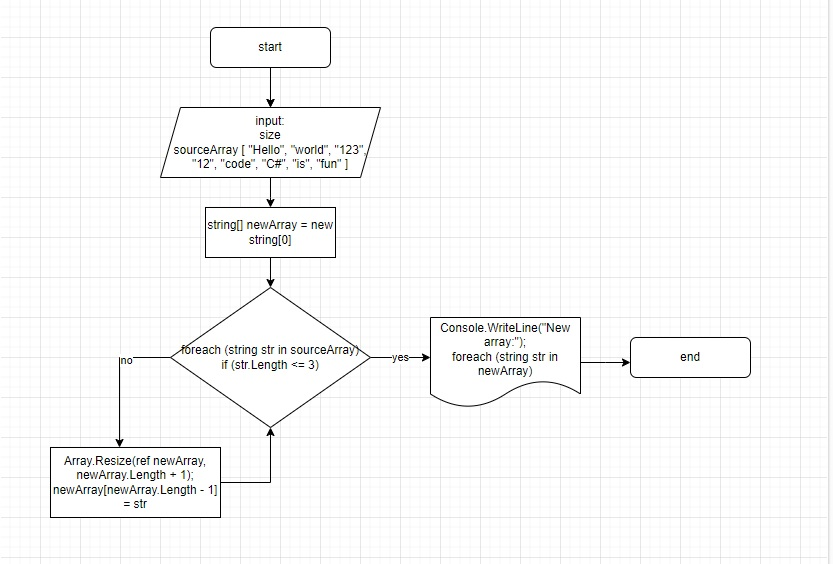

# Final-test

## Задача:
Написать программу, которая из имеющегося массива строк формирует новый массив из строк, длина которых меньше, либо равна 3 символам. Первоначальный массив можно ввести с клавиатуры, либо задать на старте выполнения алгоритма. При решении не рекомендуется пользоваться коллекциями, лучше обойтись исключительно массивами.

## Описание алгоритма решения:

1. Инициализация пустого массива для хранения результатов.

2. Ввод исходного массива строк.

3. Проверка каждой строки на длину, чтобы убедиться, что она меньше или равна 3 символам.

4. Добавление строки к массиву результатов, если она удовлетворяет условию длины.

5. Повторение процесса для каждой строки в исходном массиве.

6. Вывод результирующего массива строк.

7. Завершение программы.

### Для визуализации алгоритма смотрите блок-схему:

### Программа (создано в https://dotnetfiddle.net/, смотрите приложение program-test) 

using System;

public class Program
{
    public static void Main()
    {
        // Исходный массив строк
        string[] sourceArray = { "Hello", "world", "123", "12", "code", "C#", "is", "fun" };

        // Создаем новый пустой массив для хранения результатов
        string[] newArray = new string[0];

        // Проходим по каждой строке в исходном массиве
        foreach (string str in sourceArray)
        {
            // Проверяем длину строки
            if (str.Length <= 3)
            {
                // Увеличиваем размер массива на 1 и добавляем строку
                Array.Resize(ref newArray, newArray.Length + 1);
                newArray[newArray.Length - 1] = str;
            }
        }

        // Выводим результат
        Console.WriteLine("New array:");
        foreach (string str in newArray)
        {
            Console.WriteLine(str);
        }
    }
}

